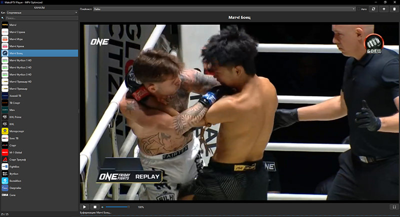

# IPTV Player - MPV Edition

Надежный IPTV плеер на базе MPV и PySide6 с исправленной работой полноэкранного режима.



## Описание

Это десктопное приложение для просмотра IPTV (Internet Protocol Television) потоков. Разработано с фокусом на стабильную работу полноэкранного режима, в отличие от предыдущих реализаций.

### Ключевые особенности

- **Полноэкранный режим без проблем**: Использует Qt для управления полноэкранным режимом вместо нативного MPV fullscreen, что устраняет конфликты и проблемы
- **Встроенный MPV**: Медиа-динамик MPV встраивается в Qt-интерфейс для оптимальной производительности
- **Управление плейлистами**: Поддержка множественных M3U плейлистов с автоматическим обновлением из URL
- **Категории каналов**: Автоматическая сортировка каналов по группам (спорт, новости, фильмы и т.д.)
- **Поиск и фильтрация**: Быстрый поиск каналов и фильтрация по категориям
- **Управление громкостью**:
  - Простой и стабильный ползунок громкости (без зависаний UI)
  - Горячие клавиши `↑`/`↓` или `+`/`-` для быстрой регулировки
- **TV-логотипы каналов**:
  - Автоматическая загрузка логотипов из плейлиста (атрибут `tvg-logo`)
  - Асинхронная загрузка с кэшированием для быстрой работы UI
  - Fallback иконка для каналов без логотипа
- **Горячие клавиши**:
  - `F11` или двойной клик: Переключение полноэкранного режима
  - `ESC`: Выход из полноэкранного режима
  - `Пробел`: Воспроизведение/остановка
  - `↑`/`↓` или `+`/`-`: Регулировка громкости

## Установка

### Требования

- Python 3.7 или новее
- Установленный MPV media player
- Windows (пути настроены под Chocolatey установку)

### Дополнительные библиотеки

- Приложение использует **qtawesome** для отображения иконок Font Awesome в UI
- Если qtawesome не установлен, используются эмодзи/текстовые символы

### Шаги установки

1. **Установите MPV** (если не установлен):
   
   - Windows: `choco install mpv`
   - Или скачайте с официального сайта: https://mpv.io/installation/

2. **Клонируйте репозиторий** или скачайте файлы:
   
   ```bash
   git clone <repository-url>
   cd iptv-mv
   ```

3. **Создайте виртуальное окружение** (рекомендуется):
   
   ```bash
   python -m venv venv
   source venv/Scripts/activate  # Windows
   ```

4. **Установите зависимости**:
   
   ```bash
   pip install -r requirements.txt
   ```

5. **Добавьте плейлист** через интерфейс приложения (Файл → Добавить плейлист)
   
   - Можно загрузить из URL или из локального файла
   - Плейлисты автоматически сохраняются для последующих запусков

## Использование

### Запуск приложения

```bash
python main_mpv.py
```

### Интерфейс

1. **Левая панель**: Список каналов с поиском и фильтрацией по категориям

2. **Правая панель**:
   
   - Видеопроигрыватель
   - Название текущего канала
   - Панель управления с Font Awesome 5 иконками (воспроизведение, стоп, громкость, полноэкранный режим)
   - Панель управления плейлистами (обновить, удалить)
   - Статус и индикатор загрузки

3. **Меню**:
   
   - **Файл → Добавить плейлист**: Загрузить новый M3U плейлист из URL или файла
   - **Файл → Выход**: Закрыть приложение
   - **Вид → Полноэкранный режим (F11)**: Переключить полноэкранный режим

### Добавление плейлистов

Приложение поддерживает два способа добавления плейлистов:

1. **Из URL**: Введите URL M3U плейлиста и название
2. **Из файла**: Выберите локальный M3U файл

Добавленные плейлисты сохраняются в `playlists.json` и автоматически загружаются при следующем запуске.

### Автообновление плейлистов

Приложение автоматически проверяет устаревшие плейлисты (старше 24 часов) и предлагает обновить их из URL.

### Удаление плейлистов

Для удаления плейлиста из списка используйте кнопку 🗑 (корзина) рядом с плейлистом. Удаление:

- Удаляет запись о плейлисте из `playlists.json`
- Не удаляет сам M3U файл с диска (на случай, если он используется в других местах)
- Очищает список каналов, если удаляется последний плейлист

## Структура плейлистов

Приложение ожидает M3U формат с `#EXTINF` метаданными:

```
#EXTM3U
#EXTINF:-1 group-title="Категория",Название канала
http://example.com/stream.m3u8
```

Категории автоматически извлекаются из `group-title` и используются для фильтрации.

## Горячие клавиши

| Клавиша             | Действие                         |
| ------------------- | -------------------------------- |
| `F11`               | Переключить полноэкранный режим  |
| `ESC`               | Выйти из полноэкранного режима   |
| `Пробел`            | Воспроизведение/остановка канала |
| `↑` или `+` или `=` | Увеличить громкость на 5%        |
| `↓` или `-` или `_` | Уменьшить громкость на 5%        |
| `Двойной клик`      | Переключить полноэкранный режим  |

## Технические детали

### Зависимости

- **PySide6** >= 6.4.0: Qt Python биндинги для UI
- **python-mpv** >= 1.0.1: Интерфейс Python для MPV
- **qtawesome** >= 1.2.2: Font Awesome 5 иконки для UI
- **MPV**: Внешняя зависимость (должна быть установлена отдельно)

### Особенности реализации

- UI создается до инициализации MPV для избежания конфликтов окон
- Полноэкранный режим реализован через Qt (`showFullScreen()` / `showNormal()`), а не MPV
- MPV встраивается в Qt через параметр `wid` (window ID)
- Потоковая загрузка плейлистов для неблокирующего UI
- Панель управления загружается асинхронно (100мс) для быстрого запуска приложения
- Метаданные плейлистов хранятся в `playlists.json`
- Простое и стабильное управление громкостью без зависаний UI

## Устранение неполадок

### При первом запуске плейлисты не загружены

- Добавьте плейлист через меню "Файл → Добавить плейлист"
- Выберите M3U файл на диске или введите URL
- Плейлист будет сохранен и автоматически загружен при следующем запуске

### Ошибка инициализации MPV

- Убедитесь, что MPV установлен: `mpv --version`
- Проверьте PATH переменную
- На Windows убедитесь, что путь к MPV добавлен в PATH

### Проблемы с полноэкранным режимом

- Не используйте MPV fullscreen (`fs`) - приложение использует Qt fullscreen
- Проверьте настройки графического драйвера
- Двойной клик на видео также переключает полноэкранный режим

### Проблемы с громкостью

- Проверьте системную громкость - MPV использует отдельную громкость от системной
- Используйте клавиши `↑` `↓` или `+` `-` для регулировки громкости
- Ползунок громкости работает стабильно без зависаний UI

### Поток не воспроизводится

- Проверьте URL потока в браузере
- Некоторые IPTV потоки требуют VPN в определенных регионах
- Проверьте логи MPV в консоли при запуске

## Лицензия

Проект распространяется под MIT лицензией.

## Поддержка

Для сообщения о проблемах используйте раздел Issues GitHub репозитория.

## Благодарности

- MPV project (https://mpv.io)
- Qt for Python (PySide6)
